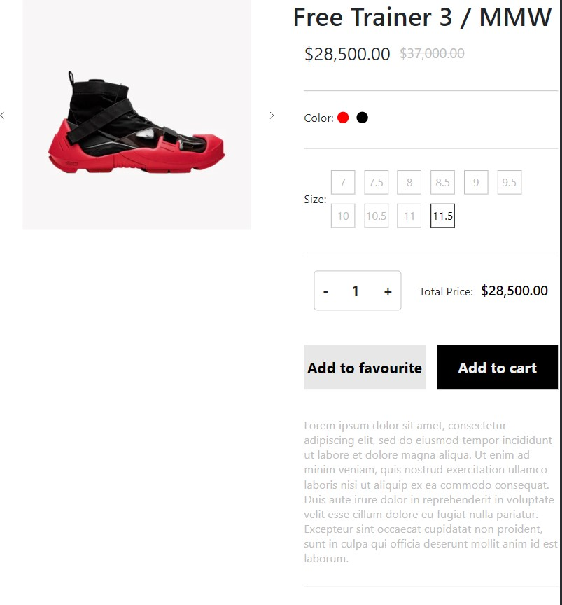
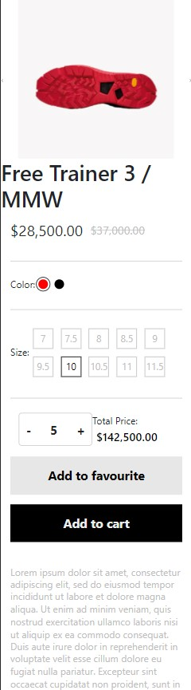
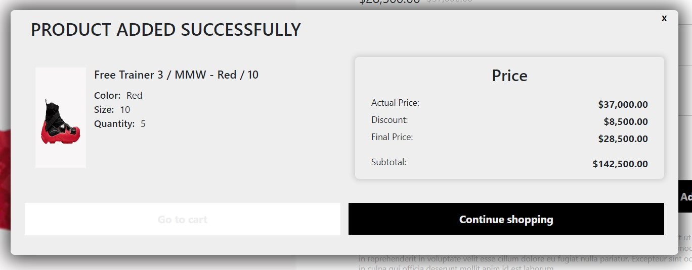

# Prueba Técnica GradiWeb Frontend Developer

https://prueba-gradi-web.herokuapp.com/

Proyecto hecho con Create React APP.

Para iniciar el proyecto se deben poner los siguientes comandos en la terminal:

### `npm install`

Luego

### `npm start`

Se desarrollo con : #ReactJS #HTML5 #CSS #JavaScript $Boostrap5

Se maqueta el layout de una vista de un producto consumuento la informacion que nos brindo el endpoint https://graditest-store.myshopify.com/products/free-trainer-3-mmw.js.

Se cumple la solicitud de crear un carusel con las imagenes brindadas por el anterior endpoint mencionado.

Tambien se cumple con generar el modal el cual dejo la imagen de demostracion en la parte de recursos y al final de este documento.

## Imagenes de muestra

## Vista Web

## Vista Tablet

## Vista Mobile

## Modal

Para que funcione el modal "add to cart" el usuario debe seleccionar las dos caracteristicas del producto (talla, color) para que se visualice este componente.

